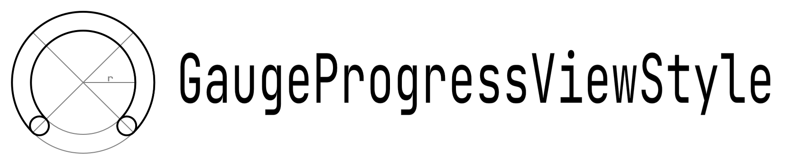
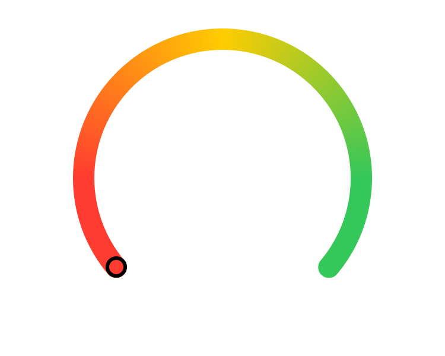
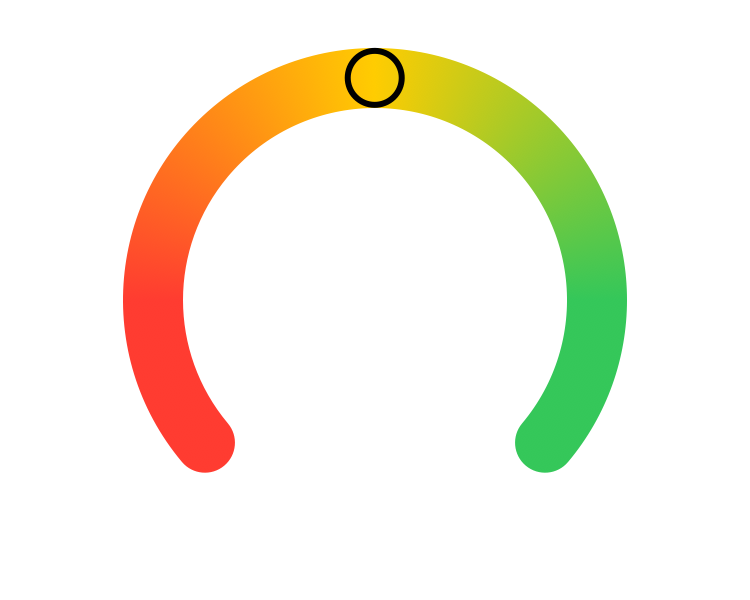
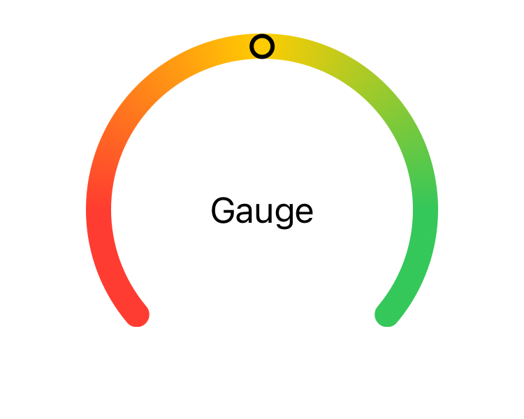
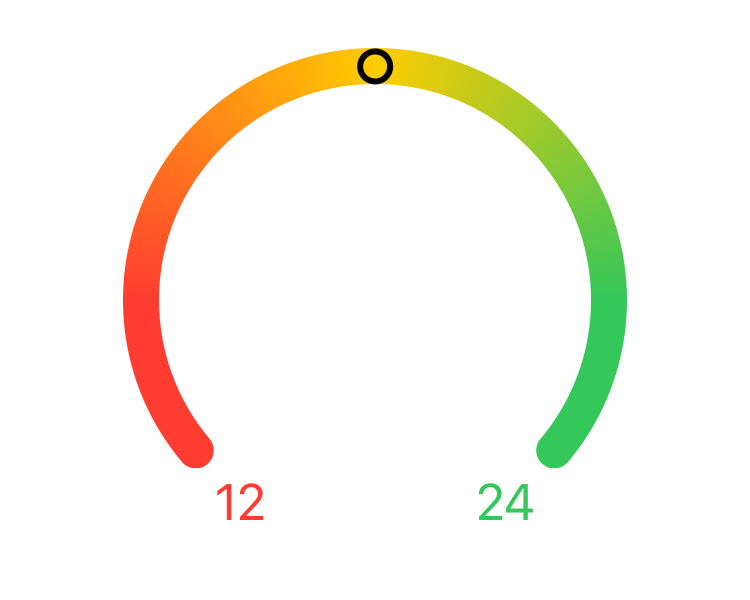
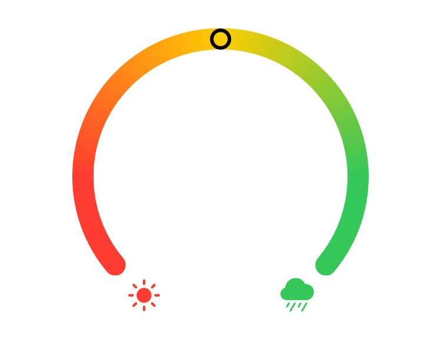

[](https://github.com/kkla320/GaugeProgressViewStyle/actions/workflows/swift.yml)  

GaugeProgressViewStyle adds the Apple Watch gauge view to iOS.

## Installation

To install GaugeProgressViewStyle, add GaugeProgressViewStyle as a dependency to your Package.swift file.

```swift
.package(url: "https://github.com/kkla320/GaugeView.git", from: "1.0.0-beta.2")
```

## Usage

Simply use the `progressViewStyle` method of `ProgressView` and pass the GaugeProgressViewStyle via one of the static members named `gauge`.
Please have a look in the [wiki](https://github.com/kkla320/GaugeProgressViewStyle/wiki) for detailed documentation.

<table>
<tr>
  <th>Code</th>
  <th>Result</th>
</tr>
<tr>
  <td>

  ```swift
  ProgressView(value: 0)
    .progressViewStyle(.gauge())
  ```

  </td>
  <td>
  
  
  
  </td>
</tr>
<tr>
  <td>

  ```swift
  ProgressView(value: 0.5)
    .progressViewStyle(.gauge(thickness: 20))
  ```

  </td>
  <td>
  
  
  
  </td>
</tr>
<tr>
  <td>

  ```swift
  ProgressView(value: 0.5) {
      Text("Gauge")
  }
  .progressViewStyle(.gauge())
  ```

  </td>
  <td>
  
  
  
  </td>
</tr>
<tr>
  <td>

  ```swift
  ProgressView(value: 0.5)
    .progressViewStyle(
        .gauge {
            Text("12")
        } upperLabel: {
            Text("24")
        }
    )
  ```

  </td>
  <td>
  
  
  
  </td>
</tr>
<tr>
  <td>

  ```swift
  ProgressView(value: 0.5)
    .progressViewStyle(
        .gauge {
            Image(systemName: "sun.max.fill")
        } upperLabel: {
            Image(systemName: "cloud.rain.fill")
        }
    )
  ```

  </td>
  <td>
  
  
  
  </td>
</tr>
</table>

## Requirements

- Swift 5.5
- iOS 14 and above

## Contributing

Simply create a pull request.
